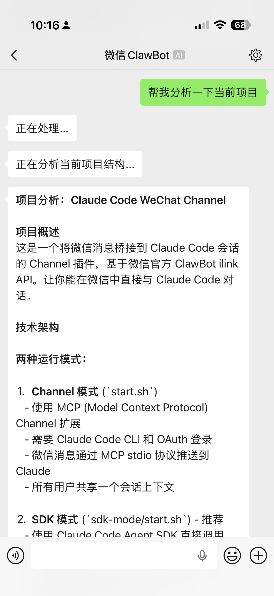

# Claude Code WeChat

[](https://opensource.org/licenses/MIT)
[](https://nodejs.org)
[](https://claude.com/claude-code)

**[English](README.md) | [中文](README.zh-CN.md)**

Connect WeChat to Claude Code — chat with Claude Code directly from WeChat.

Based on the official WeChat [ClawBot](https://github.com/nicepkg/openclaw) ilink API, this project bridges WeChat messages into Claude Code sessions, letting you interact with Claude Code from your phone.

[Why](#why) · [Quick Start](#quick-start) · [Slash Commands](#slash-commands-sdk-mode-only) · [Mode Comparison](#mode-comparison)

<p align="center">
  
</p>

## Why

- **Code from anywhere** — Review PRs, debug issues, and edit code via WeChat on your phone, without opening a laptop
- **Multi-user ready** — Each WeChat user gets an independent Claude Code session with full conversation history
- **Two modes, zero lock-in** — Channel mode for Claude Code CLI users, SDK mode for API Key users. Pick what fits your setup

## How It Works

```
WeChat user sends a message
    ↓
WeChat ClawBot → ilink API (long polling)
    ↓
Channel mode MCP server (local stdio)
    ↓ notifications/claude/channel
Claude Code receives message, generates response
    ↓
wechat_thinking / wechat_reply / wechat_send_file tools
    ↓
ilink/bot/sendmessage → WeChat user receives reply
```

## Features

| Category | Features |
|----------|----------|
| 💬 Messaging | Text send/receive, long message auto-split (2000 chars), processing status |
| 🖼 Media | Image send/receive (CDN + AES-128-ECB), file send/receive, voice-to-text |
| 👥 Social | Group chat support, link sharing, typing indicator |
| 🔄 Reliability | Token expiry auto-relogin (up to 3 retries), CDN upload retry, credential persistence |
| 🧹 Maintenance | Graceful shutdown, media auto-cleanup (7 days), log rotation (10MB) |

## Prerequisites

- [Node.js](https://nodejs.org) >= 18
- [Bun](https://bun.sh) >= 1.0 (for building; startup script auto-installs if missing)
- Python 3 (Channel mode only, for `.mcp.json` updates)
- WeChat ClawBot (iOS and Android)

**Channel mode** additionally requires:
- [Claude Code](https://claude.com/claude-code) >= 2.1.80 (must run `claude login` first)

**SDK mode** additionally requires:
- `ANTHROPIC_API_KEY` (from [Anthropic Console](https://console.anthropic.com/) or your API proxy)

## Quick Start

```bash
git clone https://github.com/turf0909/claude-code-wechat.git
cd claude-code-wechat
cp .env.example .env
# Edit .env if needed (see Authentication below)
```

Two modes are available — pick the one that fits your setup:

### SDK Mode (recommended)

Uses the Claude Agent SDK directly. Multi-user, slash commands, message queue. Requires an API Key.

```bash
# Edit .env: ANTHROPIC_API_KEY=sk-ant-xxx
./sdk-mode/start.sh

# Or specify a working directory for Claude to operate on
./sdk-mode/start.sh ~/my-project
```

### Channel Mode

Uses Claude Code CLI as the backend. Supports both API Key and OAuth (if no API Key is set, falls back to OAuth).

```bash
# Requires claude login (for CLI auth), plus optionally ANTHROPIC_API_KEY in .env
./channel-mode/start.sh

# Or with a working directory
./channel-mode/start.sh ~/my-project
```

### Authentication

The startup scripts auto-detect API configuration from `.env` (in project root):
1. `ANTHROPIC_API_KEY` set → use API Key (with optional `ANTHROPIC_BASE_URL` proxy)
2. Nothing set → use Claude Code's default API (Channel mode only)

> Channel mode always requires `claude login` regardless of API Key settings. SDK mode only needs `ANTHROPIC_API_KEY`.

> `.env` is gitignored and won't be committed. See `.env.example` for all options.

> **Working directory**: Without arguments, Claude works in the bot's own directory. With a path, Claude can read/write files and run commands in that directory — useful for having WeChat Claude help you with another project's code.

### Chat on WeChat

Open WeChat, find the ClawBot conversation, and send a message. Claude's reply is sent back to WeChat automatically.

### Using an API Proxy

To route requests through a proxy (e.g., for enterprise or regional access):

```env
# .env
ANTHROPIC_API_KEY=your-key
ANTHROPIC_BASE_URL=https://your-proxy.example.com
```

### Manual Steps (Optional)

```bash
# Install dependencies and build manually
bun install
npm run build

# Run QR login separately
node dist/setup.js
node dist/setup.js --force   # Skip "re-login?" confirmation
```

Use `WECHAT_CREDENTIALS_FILE` env var for custom credential paths (multi-user setups).

## Slash Commands (SDK Mode Only)

| Command | Description |
|---------|-------------|
| `/new` | Start new conversation (old one preserved, use `/resume` to restore) |
| `/clear` | Clear current conversation context (keep session) |
| `/stop` | Abort current running task |
| `/cancel` | Abort current task and clear queued messages |
| `/resume` | List conversation history |
| `/resume <id>` | Restore a specific conversation (prefix match) |
| `/compact` | Compact current conversation context |
| `/model` | View current model |
| `/model <name>` | Switch model (auto-validates availability) |
| `/thinking` | View Thinking mode status |
| `/thinking on/off` | Enable/disable Thinking mode (off by default; some models don't support it) |
| `/status` | View current status (model, Thinking, Session, task, version) |
| `/help` | Show command help |

## MCP Tools

| Tool | Description |
|------|-------------|
| `wechat_thinking` | Send a processing status message + typing indicator |
| `wechat_reply` | Send text reply to WeChat user (auto-splits long messages) |
| `wechat_send_file` | Send image or file to WeChat user via CDN |

## Mode Comparison

| | Channel Mode | SDK Mode (recommended) |
|---|---|---|
| Start command | `./channel-mode/start.sh` | `./sdk-mode/start.sh` |
| Authentication | `claude login` + optional API Key | **API Key only** |
| Claude Code CLI | Required | **Not required** |
| Multi-user sessions | No (shared session) | **Yes** |
| Slash commands | No | **Yes** |
| Message queue | No | **Yes** |
| Response latency | Low (persistent connection) | ~3s (API round-trip) |

## Background Running (tmux)

```bash
tmux new-session -d -s wechat './sdk-mode/start.sh ~/my-project'

# Attach to view output
tmux attach -t wechat

# Kill session
tmux kill-session -t wechat
```

## File Structure

```
├── channel-mode/
│   ├── main.ts          # Channel mode MCP server source
│   └── start.sh         # Channel mode startup script
├── sdk-mode/
│   ├── main.ts          # SDK mode main program
│   ├── wechat-tools.ts  # SDK mode MCP tools (file sending)
│   └── start.sh         # SDK mode startup script
├── scripts/
│   ├── strip-bun-marker.cjs  # Post-build: remove // @bun marker
│   ├── reset-login.sh        # Clear WeChat login state
│   └── reset-all.sh          # Full reset (login + build + deps)
├── setup.ts             # WeChat QR login tool (shared)
├── cli.mjs              # CLI entry point (for npx)
├── docs/                # Screenshots and images
├── dist/                # Build output
├── .env.example         # Environment config template
├── .gitignore
├── tsconfig.json
├── package.json
└── LICENSE
```

## Data Storage

All data saved under `~/.claude/channels/wechat/`:

| File | Description |
|------|-------------|
| `account.json` | WeChat login credentials (bot token, base URL, account ID) |
| `context_tokens.json` | Per-user/group context tokens (with TTL) |
| `sdk_sessions.json` | SDK mode user-session mapping |
| `sync_buf.txt` | Message sync cursor for long polling |
| `debug.log` / `sdk_debug.log` | Debug logs (max 10MB, rotated) |
| `media/` | Downloaded images and files (auto-cleanup after 7 days) |

## Notes

- Channel mode and SDK mode share WeChat credentials but **cannot run simultaneously** (both poll the same message queue)
- ClawBot supports both iOS and Android
- First launch shows a QR code in terminal — scan with WeChat to log in
- If QR scan times out, restart the script to get a new QR code

## Reset

```bash
# Clear login state only (keep build)
./scripts/reset-login.sh

# Full reset (back to post-clone state)
./scripts/reset-all.sh
```

## Contributing

Contributions are welcome! Feel free to open issues and pull requests.

## Acknowledgments

- [ClawBot](https://github.com/nicepkg/openclaw) — WeChat bot platform providing the ilink API
- [Claude Code](https://claude.com/claude-code) — Anthropic's CLI for Claude, powering the AI backend
- [@anthropic-ai/claude-agent-sdk](https://www.npmjs.com/package/@anthropic-ai/claude-agent-sdk) — SDK for programmatic Claude Code access

## License

[MIT](LICENSE)
